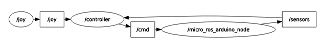

# microros_controller_template
Template for communication between ros2 and microros (teensyduino)


## Prerequisites

Ensure you have the following installed:

- ROS 2 (Foxy or later)
- [microsros](https://micro.ros.org/docs/tutorials/core/teensy_with_arduino/) (The platform.txt patch file is availale in the repo)

## Installation

- Clone this repo into your ROS2 workspace
- Build your workspace
- Compile and upload the arduino code to your teensy

## Usage

1. Ensure your ROS 2 environment is set up properly. Microros should be set in another workspace
2. In one terminal, launch your template node (make sure your ROS2 workspace is sourced):

    ```
    ros2 launch microros_controller_template start.launch.py 
    ```

3. In another terminal, run the microros agent (make sure your microros workspace is sourced):

    ```
    ros2 run micro_ros_agent micro_ros_agent serial --dev /dev/ttyACM0
    ```


The node will start running and begin communicating with other nodes in the ROS 2 network.

## Functionality

**Subscribers**:
- /joy: Subscribes to joystick input change control modes and commands.
- /sensors: Subscribes to sensor data for providing feedback from the micro controller.

**Publishers**:
- /cmd: Publishes control commands the micro controller.

**Control Logic**:
The script implements logic to process joystick input and sensor feedback to determine the appropriate mode and submode for control commands. Control commands are sent periodically based on a timer.




## Customization

Change the modes, commands and functions in the python script or your arduino code based on your program needs.


